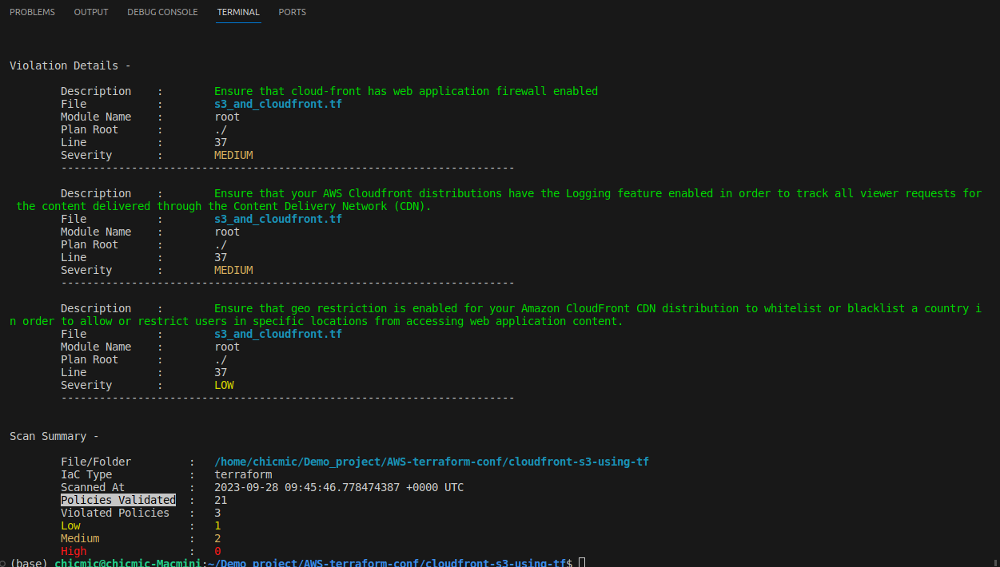
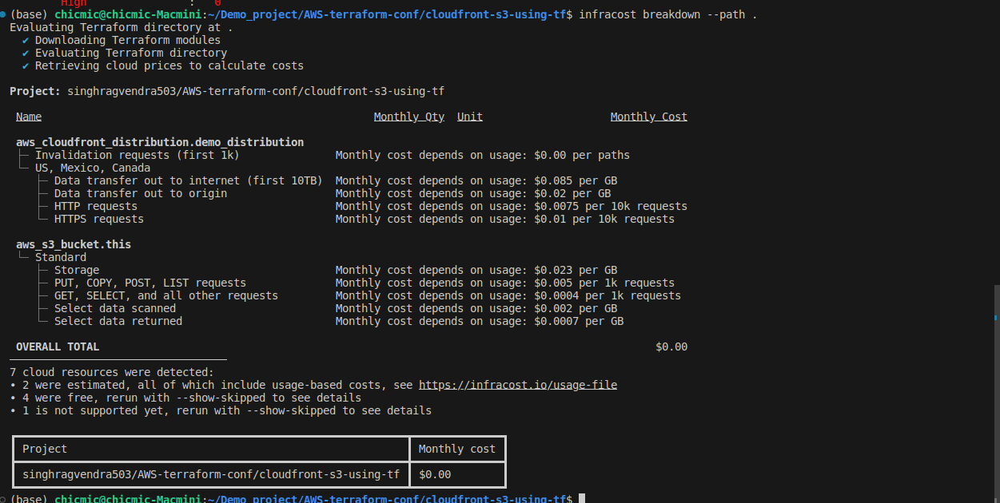

# AWS CloudFront and S3 Bucket Configuration
This Terraform script creates an Amazon Web Services (AWS) infrastructure that consists of an S3 bucket, a CloudFront distribution, and the necessary access controls to serve static web content. The infrastructure is designed for hosting a static website with Amazon S3 as the origin storage and CloudFront as the content delivery network (CDN).
## Prerequisites
- AWS account with appropriate permissions.
- Terraform installed on your local machine.
- AWS CLI configured with necessary credentials and default region.

## Configuration

1. Clone this repository to your local machine:

   ```bash
   git clone https://github.com/singhragvendra503/AWS-terraform-conf.git
   cd AWS-terraform-conf/cloudfront-s3-using-tf
2. Create a `terraform.tfvars` file in the same directory with the following content:
```
    access_key      = "your_aws_access_key"
    secret_key      = "your_aws_secret_key"
    bucket_name     = "bucket name " # Globally unique
    environment     = "production,testing or staging"
```
3. Initialize Terraform by running:
```bash
terraform init
```
## Deploy the infrastructure by running:
```bash
terraform apply --auto-approve
```

## Terraform Configuration
This script includes the following AWS resources and configurations:
### 1. S3 Bucket
- Creates an S3 bucket with the specified name.
- Sets the access control list (ACL) of the bucket to private.
### 2. CloudFront Origin Access Control
- Defines an origin access control for CloudFront with specific settings.  
- Associates the access control with the S3 bucket.
### 3. CloudFront Distribution
- Creates a CloudFront distribution, specifying the S3 bucket as the origin.
- Configures various settings for the CloudFront distribution, including enabling IPv6, specifying a comment, and setting default root objects.
- Defines a default cache behavior for handling HTTP requests.
- Sets price class and restrictions for the distribution.
- Specifies tags to identify the distribution in AWS.
### 4. S3 Bucket Policy
- Grants read permission to the CloudFront origin access identity to allow CloudFront to fetch content from the S3 bucket.
### 5. Custom Error Responses
- Configures custom error responses to handle 403 and 404 errors by redirecting to the /index.html page. This is useful for single-page applications (SPAs).
## Clean Up infrastructure by running:
```bash
terraform destroy --auto-approve
```
## Scan Policy Validation Using [terrascan](https://runterrascan.io/)

## Mothly Cost Calculated Using [infracost](https://www.infracost.io/)
