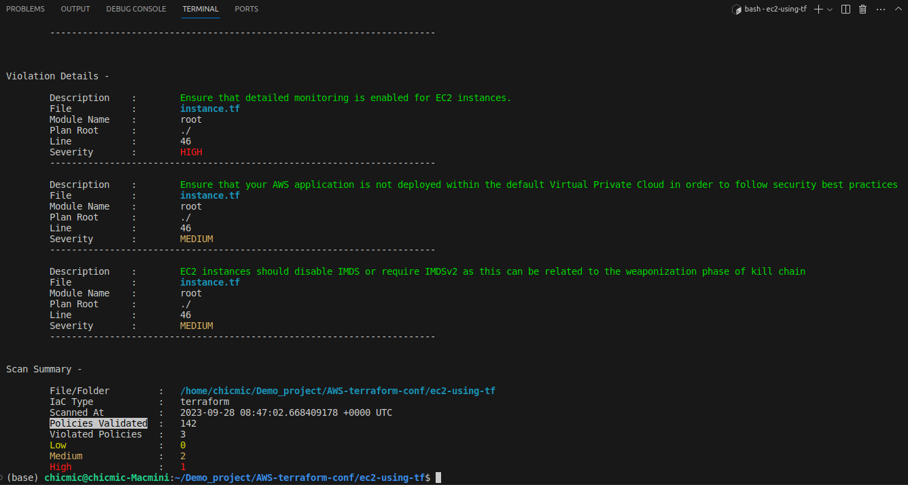
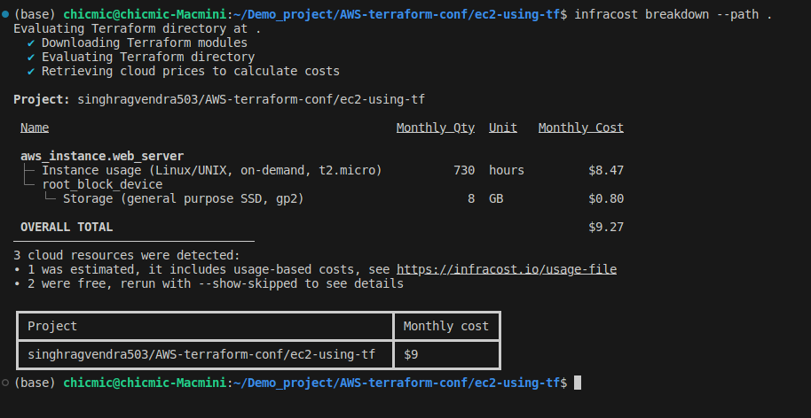

# Create AWS EC2 instance using Terraform script

This Terraform configuration creates an AWS infrastructure consisting of an EC2 instance, an SSH key pair, a security group, and dynamically selects an AMI based on filter criteria.

## Prerequisites

Before you begin, ensure you have the following:

1. [Terraform](https://www.terraform.io/downloads.html) installed on your local machine.
2. AWS credentials (access key and secret key) with the necessary permissions to create resources.
3. **SSH Key Pair:** This configuration assumes you have an SSH key pair configured on your local machine. If not, you can generate one using `ssh-keygen`. Replace `"~/.ssh/id_rsa.pub"` in the configuration with the path to your public SSH key.


## Configuration

1. Clone this repository to your local machine:

   ```bash
   git clone https://github.com/singhragvendra503/AWS-terraform-conf.git
   cd AWS-terraform-conf/ec2-using-tf
2. Create a `terraform.tfvars` file in the same directory with the following content:
```
    access_key      = "your_aws_access_key"
    secret_key      = "your_aws_secret_key"
    ports           = [22, 80, 443] # List of allowed ports
    instance_type   = "t2.micro"    # EC2 instance type
    image_name      = "ubuntu"      # AMI filter name
```
3. Initialize Terraform by running:
```bash
terraform init
```
## Deploy the infrastructure by running:
```bash
terraform apply --auto-approve
```
## Variables
- access_key: Your AWS access key.
- secret_key: Your AWS secret key.
- ports: List of allowed ports for the security group.
- instance_type: EC2 instance type.
- image_name: Name used to filter the AMI dynamically.

Note* If got error llike this;
***Error: Your query returned no results. Please change your search criteria and try again.***
- Variable image_name: Name replace by `ubuntu/images/hvm-ssd/ubuntu-*`

## Clean Up infrastructure by running:
```bash
terraform destroy --auto-approve
```
## Scan Policy Validation Using [terrascan](https://runterrascan.io/)

## Mothly Cost Calculated Using [infracost](https://www.infracost.io/)
